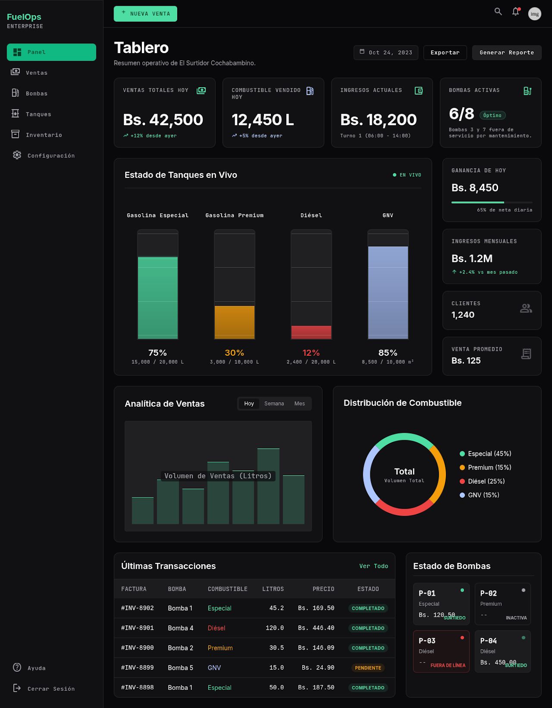

<div align="center">

# ⛽ Sistema Digital de Control y Gestión para Surtidor de Gasolina
### *"El Surtidor Cochabambino"*

<p>
Sistema moderno para la administración integral de una estación de servicio, desarrollado con tecnologías web de última generación, arquitectura escalable y principios de Sistemas Digitales.
</p>

<br>


<br>


</div>

---

## 🚀 Tecnologías Principales

<div align="center">

| Frontend | Backend | Base de Datos | UI | Estado | Testing | Deploy |
|:---------:|:-------:|:-------------:|:--:|:------:|:-------:|:------:|
| <br>Next.js | <br>Supabase | <br>PostgreSQL | <br>Tailwind CSS | <br>Zustand | <br>Jest | <br>Vercel |

</div>

---

## 🛠️ Ecosistema Tecnológico

<div align="center">


</div>

---

## Sistema Digital de Control y Gestión para Estación de Servicio

[]()
[]()
[]()

Proyecto final de la materia **Programación 4**. Aplicación web multiplataforma para la gestión operativa de la estación de servicio **"El Surtidor Cochabambino"** (Cochabamba, Bolivia). El proyecto integra el desarrollo de software con los fundamentos teóricos de **Sistemas Digitales** (códigos binarios, álgebra de Boole, mapas de Karnaugh, compuertas lógicas y decodificadores) sobre un caso real de gestión de surtidores, ventas, alertas e inventario.

---

# 🎨 Diseño de la Interfaz (UI/UX)

La interfaz del proyecto fue diseñada utilizando **Google Stitch**, siguiendo principios modernos de diseño inspirados en **Supabase**, **Vercel**, **Linear** y **shadcn/ui**.

El objetivo fue construir una experiencia de usuario limpia, minimalista y profesional para la gestión integral de una estación de servicio.

## Vista previa del proyecto



---

### 🔗 Explorar el diseño interactivo

<p>
<a href="https://stitch.withgoogle.com/projects/7250272114523253897">

</a>
</p>

**Proyecto público:**

https://stitch.withgoogle.com/projects/7250272114523253897

</div>

> 💡 **Nota:** El prototipo fue generado utilizando **Google Stitch**, una herramienta de Google Labs para el diseño de interfaces mediante IA. Posteriormente será utilizado como referencia para la implementación completa del frontend con **Next.js**, **TypeScript**, **Tailwind CSS** y **shadcn/ui**. :contentReference[oaicite:0]{index=0}

---

---

## 📑 Tabla de Contenidos

1. [Arquitectura y Stack Tecnológico](#-1-arquitectura-y-stack-tecnológico)
2. [Fundamentación en Sistemas Digitales](#️-2-fundamentación-en-sistemas-digitales)
3. [Modelo de Datos](#-3-modelo-de-datos)
4. [Patrones de Diseño](#-4-patrones-de-diseño)
5. [Módulos Funcionales](#-5-módulos-funcionales)
6. [Instalación y Ejecución](#-6-instalación-y-ejecución)
7. [Calidad de Software](#-7-calidad-de-software)
8. [Cronograma](#-8-cronograma-de-desarrollo)
9. [Entregables](#-9-entregables)
10. [Checklist de Evaluación](#-10-checklist-de-evaluación)
11. [Equipo](#-11-equipo)

---

## 📌 1. Arquitectura y Stack Tecnológico

| Capa | Tecnología | Justificación |
|---|---|---|
| **Frontend / UI** | Next.js (React) + TypeScript + Tailwind CSS | Multiplataforma real: mismo código sirve como app web y, empaquetado con Electron/Tauri, como app de escritorio. |
| **Backend** | Supabase (Postgres + API auto-generada + Auth + Realtime) | Elimina la necesidad de mantener un servidor propio; la BD, la autenticación y las suscripciones en tiempo real (útiles para las alertas) ya vienen resueltas. |
| **Base de Datos** | PostgreSQL (gestionado por Supabase) | Persistente, en la nube, con backups automáticos; reemplaza a SQLite para que el despliegue en Vercel no dependa de un archivo local. |
| **Cliente de datos** | `@supabase/supabase-js` | SDK oficial para consultas, autenticación y suscripción a cambios en tiempo real (ideal para el módulo de Alertas). |
| **Estado global** | Zustand / Context API | Gestión simple del estado de alertas en tiempo real en el cliente. |
| **Prototipo UI** | Figma | Wireframes y diseño visual antes de codificar. |
| **Calidad** | SonarQube + Jest / Vitest | Análisis estático y pruebas unitarias. |
| **Despliegue** | Vercel (frontend + API routes) + Supabase Cloud (backend/BD) | Ambos tienen capa gratuita, se integran de forma nativa (incluso hay una integración oficial de Vercel para Supabase) y no requieren gestionar servidores. |

> **¿Por qué funciona bien en Vercel?** Vercel es serverless: cada request a una API route levanta una función efímera sin disco persistente, por eso SQLite local no era ideal ahí. Con Supabase, la base de datos vive fuera de Vercel (en la infraestructura de Supabase), así que Vercel solo necesita las variables de entorno para conectarse — cero fricción.
>

---

## ⚙️ 2. Fundamentación en Sistemas Digitales

El núcleo "inteligente" del sistema no es solo un CRUD: cada regla de negocio crítica se modela primero como circuito digital y luego se traduce a código.

### A. Codificación binaria del nivel de tanque

Cada surtidor tiene un sensor de nivel digitalizado a **2 bits** ($N_1 N_0$):

| Código ($N_1N_0$) | Nivel | Rango | Acción |
|:---:|:---:|:---:|:---|
| `00` | Vacío | 0% – 10% | 🔴 Alerta crítica |
| `01` | Bajo | 11% – 25% | 🟡 Alerta preventiva |
| `10` | Medio | 26% – 75% | ✅ Normal |
| `11` | Lleno | 76% – 100% | ✅ Normal |

### B. Álgebra de Boole y Mapas de Karnaugh (lógica de alertas)

Variables de entrada: $N_1$, $N_0$. Salidas: $LED_{Rojo}$, $LED_{Amarillo}$.

**Tabla de verdad:**

| $N_1$ | $N_0$ | $LED_{Rojo}$ | $LED_{Amarillo}$ |
|:---:|:---:|:---:|:---:|
| 0 | 0 | 1 | 0 |
| 0 | 1 | 0 | 1 |
| 1 | 0 | 0 | 0 |
| 1 | 1 | 0 | 0 |

**Funciones simplificadas (ya minimizadas, un solo término cada una):**

$$LED_{Rojo} = \overline{N_1} \cdot \overline{N_0}$$
$$LED_{Amarillo} = \overline{N_1} \cdot N_0$$

**Mapa de Karnaugh (2 variables):**

```
        N0=0   N0=1
N1=0  [  1   ][  0  ]   → LED_Rojo (única celda en 1)
N1=1  [  0   ][  0  ]

        N0=0   N0=1
N1=0  [  0   ][  1  ]   → LED_Amarillo (única celda en 1)
N1=1  [  0   ][  0  ]
```

**Circuito equivalente (compuertas):**

```
N1 ──┬──[NOT]── N1' ──┬──[AND]── LED_Rojo
N0 ──┼──[NOT]── N0' ──┘
     │
     └──[NOT]── N1' ──┬──[AND]── LED_Amarillo
N0 ──────────────────┘
```

### C. Aritmética binaria en ventas

El total de cada venta:

$$Total = Litros \times Precio$$

se implementa como una función pura que **documenta explícitamente** el proceso de multiplicación por sumas y desplazamientos (equivalente a una ALU de microcontrolador), antes de redondear y persistir el valor decimal final en la base de datos. Esto se expone como un módulo aislado (`/lib/alu.ts`) para que sea evaluable de forma independiente en las pruebas unitarias.

### D. Decodificador de combustible (2 a 4 líneas)

El tipo de combustible se guarda codificado en 2 bits ($C_1C_0$):

| Código | Combustible |
|:---:|:---|
| `00` | Gasolina Especial |
| `01` | Gasolina Premium |
| `10` | Diésel |
| `11` | GNV |

Un decodificador de 2×4 traduce el código a texto legible para la UI y los reportes, y en la dirección inversa (codificador) convierte la selección del usuario de vuelta a binario para almacenarla.

---

## 🗄️ 3. Modelo de Datos

Tablas en el esquema `public` de Supabase (Postgres):

```
surtidores
├── id                uuid (PK, default gen_random_uuid())
├── numero            int
├── tipo_combustible  smallint   -- 2 bits → decodificado (0-3)
├── capacidad_litros  numeric
├── nivel_binario     smallint   -- 2 bits: 00/01/10/11 (0-3)
├── estado            text       -- 'activo' | 'mantenimiento'
└── created_at        timestamptz default now()

ventas
├── id                uuid (PK, default gen_random_uuid())
├── surtidor_id       uuid (FK → surtidores.id)
├── fecha             timestamptz default now()
├── litros            numeric
├── precio_unitario   numeric
└── total             numeric   -- calculado vía módulo ALU antes de insertar

alertas
├── id                uuid (PK, default gen_random_uuid())
├── surtidor_id       uuid (FK → surtidores.id)
├── tipo              text      -- 'LED_ROJO' | 'LED_AMARILLO'
├── timestamp         timestamptz default now()
└── resuelta          boolean default false
```

> Estas tablas se crean con el **SQL Editor de Supabase** o con sus migraciones (`supabase/migrations`). Se recomienda activar **Row Level Security (RLS)** en las tres tablas y definir políticas básicas (lectura/escritura para el rol autenticado) antes del despliegue.
>
> El canal `Realtime` de Supabase sobre la tabla `alertas` es lo que permite que el módulo de Alertas se actualice en el frontend sin necesidad de polling.

---

## 🧩 4. Patrones de Diseño

| Tipo | Patrón | Aplicación |
|---|---|---|
| **Creacional** | Singleton | Instancia única del cliente de Supabase (`createClient`) compartida en toda la app, evitando reconexiones innecesarias. |
| **Estructural** | Repository / Adapter | Capa (`/lib/repositories`) que envuelve las llamadas a `supabase-js`; si mañana cambia el backend, solo se toca esta capa y no los componentes. |
| **Comportamiento** | Observer | Suscripción a **Supabase Realtime** sobre la tabla `alertas`: cada cambio de nivel dispara el evento, un observador evalúa la función booleana y actualiza el LED en la UI sin acoplar sensor ↔ interfaz. |

---

## 🧰 5. Módulos Funcionales

| Módulo | Funcionalidad | Vínculo con Sistemas Digitales |
|---|---|---|
| **Surtidores** | Alta, listado, edición y baja de surtidores | Nivel representado y validado en binario (00/01/10/11) |
| **Ventas** | Registro de ventas por surtidor, fecha, litros y total | Cálculo del total vía módulo tipo ALU |
| **Alertas** | Monitoreo de nivel bajo/crítico en tiempo real | Compuertas lógicas + mapas de Karnaugh (sección 2B) |
| **Reportes** | Ventas diarias, inventario, ingresos por tipo de combustible | Decodificador 2→4 para mostrar el combustible legible |

---

## 🚀 6. Instalación y Ejecución

```bash
# Clonar el repositorio
git clone https://github.com/infierno666/surtidor-cochabambino.git
cd surtidor-cochabambino

# Instalar dependencias
npm install

# Levantar entorno de desarrollo
npm run dev
```

1. Crea un proyecto gratuito en [supabase.com](https://supabase.com).
2. En el **SQL Editor**, corre el script de creación de las tablas `surtidores`, `ventas` y `alertas` (sección 3).
3. Copia la URL del proyecto y la `anon key` desde *Project Settings → API*.

Variables de entorno (`.env.local`):

```env
NEXT_PUBLIC_SUPABASE_URL="https://<tu-proyecto>.supabase.co"
NEXT_PUBLIC_SUPABASE_ANON_KEY="<tu-anon-key>"
```

**Despliegue en Vercel:**
1. Importa el repositorio en Vercel.
2. Agrega las mismas dos variables de entorno en *Project Settings → Environment Variables*.
3. Vercel detecta Next.js automáticamente — no requiere configuración adicional de build.

---

## ✅ 7. Calidad de Software

- **Pruebas unitarias:** Jest/Vitest sobre el módulo de lógica booleana (`alertas.test.ts`) y el módulo ALU (`alu.test.ts`), verificando la tabla de verdad completa.
- **Análisis estático:** SonarQube (duplicación de código, code smells, cobertura mínima sugerida: 70%).
- **Linter:** ESLint + Prettier.

---

## 📅 8. Cronograma de Desarrollo

| Fase | Contenido | Estado |
|---|---|---|
| **Fase 1 – Diseño e Infraestructura** | Repositorio, esquema SQLite, wireframes en Figma | 🔄 En curso |
| **Fase 2 – Núcleo de Sistemas Digitales** | Clases/funciones de lógica binaria, decodificador y compuertas de alerta | ⬜ Pendiente |
| **Fase 3 – CRUDs y Patrones** | Interfaces de Surtidores, Ventas y Reportes con Singleton/Repository/Observer | ⬜ Pendiente |
| **Fase 4 – Calidad y Despliegue** | Pruebas unitarias, SonarQube, deploy en Vercel/Render | ⬜ Pendiente |

---

## 📦 9. Entregables

- [ ] Código fuente en GitHub (este repositorio)
- [ ] Prototipo de UI en Figma (enlace: *pendiente*)
- [ ] Aplicación desplegada (Vercel / Render — enlace: *pendiente*)
- [ ] Documento de sustentación técnica (opcional, según rúbrica)

---

## 📋 10. Checklist de Evaluación

> Marca cada punto conforme lo vayan completando, para verificar cobertura total de la rúbrica antes de la entrega.

- [ ] Códigos binarios definidos y usados de forma consistente (sensores, combustible)
- [ ] Álgebra de Boole y mapa de Karnaugh documentados y simplificados correctamente
- [ ] Compuertas lógicas implementadas (aunque sea en software) para las alertas
- [ ] Decodificador/codificador de combustible funcionando en la UI
- [ ] Aritmética binaria explícita en el cálculo de ventas
- [ ] 3 patrones de diseño identificables en el código (no solo mencionados)
- [ ] Base de datos SQLite + ORM funcionando con CRUD completo
- [ ] Prototipo de interfaz (Figma) coherente con la app final
- [ ] Pruebas unitarias corriendo y con reporte de cobertura
- [ ] SonarQube ejecutado y sin issues críticos abiertos
- [ ] Deploy accesible públicamente

---

## 👥 11. Equipo

| Nombre | Rol |
|---|---|
| Daniel Maldonado Cespedes | Desarrollador FullStack|

---

## 📄 Licencia

Este proyecto se distribuye bajo licencia MIT con fines académicos.